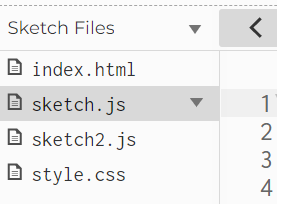
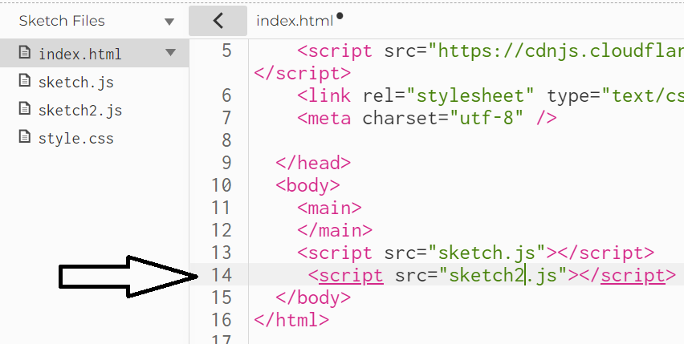
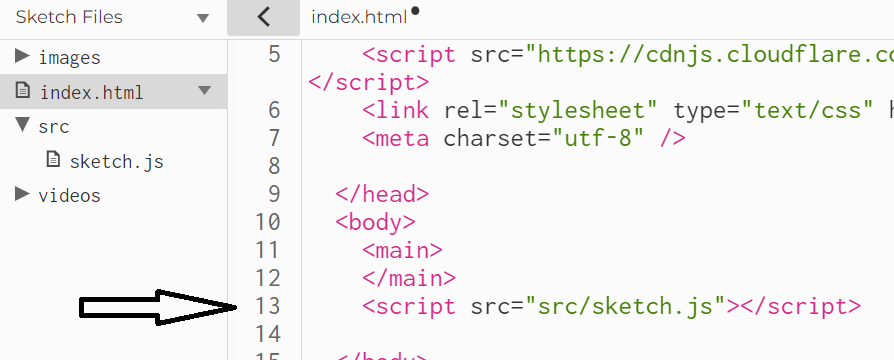

# 18. Udviklingsmiljø og versioneringskontrol
Et godt udviklingsmiljø er helt centralt, hvis man skal blive en god og produktiv programmør på sigt. Det giver bl.a. mulighed for at finde fejl hurtigere pga muligheden for debugning og syntaks highlightning (giver koden farve efter dens struktur), teste nemmere, forslag til kode og mulighed for at arbejde med andre udviklere på samme projekt. Det er essentielt at kende sit udviklingsmijø godt.
Man kan måske sammenligne det lidt med en forfatter, der måske nok kan vælge at skrive sin bog på en gammel skrivemaskine, men som med de moderne tekstbehandlingssystemer til rådighed meget nemmere kan rette fejl, slå op i synonym ordbog osv.

I det følgende vil vi gennemgå i detaljer hvorledes man 

- skriver kode via editoren på p5js.org og deler den med andre
- installere og bruger editoren VS kode
- installere og bruger versioneringssystemet Github.

Versioneringssystemer spiller en central rolle i moderne udvikling, da det giver mulighed for at arbejde sammen på projekter og i det hele taget holde styr på udviklingen af ens kode. Det gør det nemt at gå tilbage til en tidligere version af ens kode.

## Brug af editoren på p5js.org
For at starte op med at kode skal du ind på p5js.org og trykke på "Editor":


Det vil kun være muligt at gemme, hvis du opreter en konto og logger ind. Det kan gøres ret nemt med gmail/github konto eller man kan oprette en konto på en anden mail. Alle filer bliver gemt i skyen. Du kan selvfølgelig hente dine programmer ned, hvis du er interesseret i det. 

Herefter kommer du ind i en menu, der ser således ud:


Til venstre ses feltet hvor du skriver koden. Til højre resultatet af din kode, hvis du har trykket "Play" på den røde knap med trekanten. 
Konsollen ses nederst i venstre hjørne. Den kan eksempelvis være god at bruge, når du f.eks. vil udskrive nogle variablers værdier for at tjekke om de rent faktisk er det du tror de er.
Du kan lave nye filer under, dele projekter og se andres projekter oppe i menuen:


Kollektioner er en mulighed for at samle filer og dele dem med andre: 


Når du ønsker at sprede din kode udover flere filer, så kan det også ret let lade sig gøre ved at gå op i hovedmenuen og trykke på "Sketch" efterfulgt af menupunktet "Add file". Her giver du filen et navn. Husk at hvis det skal være javascript kode skal den have efternavnet js til sidst. I det følgende har vi lavet en ny fil som vi har kaldt for sketch2.js. Tryk på vinklen ude til venstre for at danne dig et overblik over din kode: 


For at du kan bruge filen er det nødvendigt at inkludere den i din html kode. Vær her særligt opmærksom på rækkefølgen af de filer du inkluderer. Hvis en fil y er afhængig af en anden fil x, så bør x inkluderes før y. 



Generelt er det en god ide tidligt at lave en fornuftig filstruktur for dine projekter. Det bliver essentielt når man begynder at lave større projekter, der måske spreder sig over mange forskellige kodefiler og som inkluderer måske, både lyd, billeder og video. 
En mulig overordnet struktur kunne være noget ala følgende: 


Mapperne kan du lave op under Sketch->Add folder. 
- src rummer alle javascript filerne
- videos rummer alle videoer
- images rummer alle billeder


Ud fra hver folder kan du tilføjer nye filer eller uploade filer til mappen. 

Vær dog opmærksom på at inkludere de rigtige stier i din html fil. Her er et eksempel på hvorledes man kunne inkludere en fil kaldet sketch.js, som ligger i src:



Bemærk tilføjelsen af "src/" i linje 13.

Det afslutter vores korte gennemgang af de vigtigste funktioner i online editoren. Endelig vil vi også gøre opmærksom på, at kigger man på html koden har man måske bemærket følgende linjer i head-tag:

```javascript
<script src="https://cdnjs.cloudflare.com/ajax/libs/p5.js/1.4.1/p5.js"></script>
<script src="https://cdnjs.cloudflare.com/ajax/libs/p5.js/1.4.1/addons/p5.sound.min.js">
```

Disse linjer sørger for at inkludere p5-biblioteket. Det er alt hvad der skal til. Med mindre at du skal afspille lyd kan du faktisk også slette inklusionen af det sidste script.

## Visual studio code